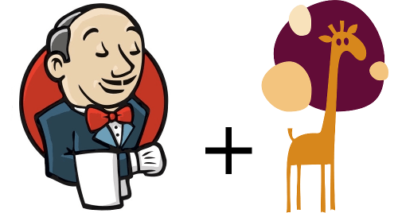
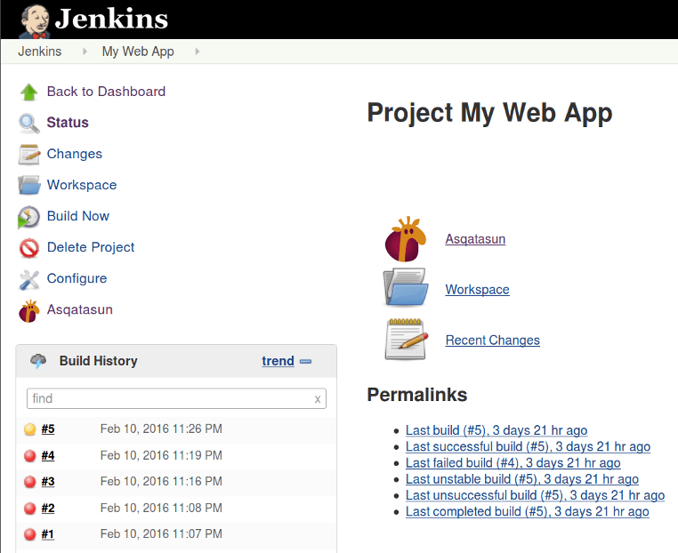

 

# Asqatasun Jenkins plugin 

This project is the **Jenkins plugin** of Asqatasun. 

> If you are only interested in testing web accessibility 
> in a graphical environment, please go to [Asqatasun Documentation](http://doc.asqatasun.org/en/).

----

The Jenkins plugin of Asqatasun is dedicated to integrate the web accessibility 
tests Asqatasun can do into a Quality Assurance (QA) plateform, here **Jenkins**.
It allows for example to add accessibility tests of a web application on a nightly 
build process (for instance just after the unit tests and functional tests).

The Jenkins plugin of Asqatasun is opensource ([AGPL v3](LICENSE) license).

## Problem & solution

You already have a QA platform (Jenkins) to build and test your app. Different kinds of 
tests are performed thanks to various Jenkins plugins (unit tests, functional 
tests, smoke tests, performance tests...). 

For **accessibility testing**, your staff uses some automated tools and human tests, but
you would like to have a stack of basic accessibility tests done in a **fully automated and integrated**
fashion.

You know this is not sufficient to have a full compliance with accessibility guidelines,
but this is a **good starting point to seamlessly improve the accessibility level** of your app
(and by the way the accessibility skills of your dev team ;) ).

Asqatasun Jenkins plugin is meant to *mechanize* the tests provided by Asqatasun.

## Features

* Leverage strong level of automation provided by Asqatasun
* Benefit from highly reliable tests of Asqatasun
* Have stable or broken build depending on a given level of acceptance 
(for instance, stable = at least 80% of tests are OK)
* Have a centralized control panel in Jenkins

You may also generate graphs of various metrics including:

* Asqatasun Meter (the performance score of accessibility)
* Number of Passed / Failed / Not Applicable tests
* Number of occurrences of failed tests

All audits ran can also be viewed in detail within Asqatasun web application, easing the
identification of given errors.

You will find a detailed [list of accessibility tests in Asqatasun Documentation](http://doc.asqatasun.org/en/).

## Download

[Asqatasun Jenkins plugin latest release (.hpi, ~700kb)](https://github.com/Asqatasun/Asqatasun-Jenkins-Plugin/releases)

## Installation and documentation

* [Network architecture](documentation/10--Network-Architecture.md)
* [Installation doc](documentation/20-install-doc.md)
* [Configuration of Jenkins-plugin](documentation/30-configuration.md)
* [Configuration of item](documentation/35-configuration-of-item.md)
* [Run the build and view the results](documentation/40-usage.md)
* [Graphs creation and customisation](documentation/50-graphs.md)
* [Developer doc (how to build, to contribute)](documentation/60-developer-doc.md)

## Support and discussions

* [Asqatasun discussion space](http://forum.asqatasun.org/) 
* [Twitter @Asqatasun](https://twitter.com/Asqatasun)
* email to `asqatasun AT asqatasun dot org` (only English, French and klingon is spoken :) ) 

## Contribute

We would be really glad to have you on board ! You can help in many ways:

* [Fill in bug report](https://github.com/Asqatasun/Asqatasun-Jenkins-Plugin/issues)
* [Pull Requests](https://github.com/Asqatasun/Asqatasun-Jenkins-Plugin/pulls) are of course welcome

Everything is summarized in the [CONTRIBUTING](CONTRIBUTING.md) file.

## License

 [AGPL v3](LICENSE) 

 
