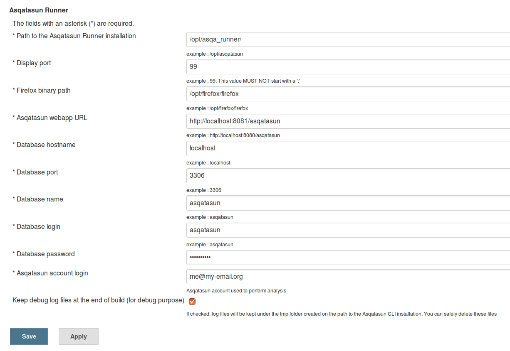

# Use Asqatasun and Jenkins with Docker

## Single container
- This is a fat container, that is absolutely not compliant to [Docker best-practices](https://docs.docker.com/engine/userguide/eng-image/dockerfile_best-practices/)
- Don't use it for production as all data are wiped out at reboot / rebuild
- BUT for quick testing, that does the job :)

## 0. Know nothing about Docker ?

... begin here !

* Get Started with [Docker for Windows](https://docs.docker.com/engine/installation/windows/)
* Get Started with [Docker for Mac OS X](https://docs.docker.com/engine/installation/mac/)
* Get Started with [Docker for Linux](https://docs.docker.com/engine/installation/linux/)


## 1. Create a container from [Docker Hub](https://hub.docker.com/r/Asqatasun/Asqatasun-Jenkins-Plugin/)

```sh
docker pull Asqatasun/Asqatasun-Jenkins-Plugin
docker run --name asqatasun_jenkins -d -p 8081:8080 -p 8089:8089 Asqatasun/Asqatasun-Jenkins-Plugin
```

**AND** wait ~30 seconds before going to the next step (to allow the container to start).


## 2. Use your local Asqatasun

### Linux users

* In your browser, go to `http://localhost:8081/asqatasun/` 
* Use this user and this password :
    * `me@my-email.org`
    * `myAsqaPassword`

### MacOSX and Windows users

* Get the IP address with command `docker-machine ip default`
* In your browser, go to `http://<the_IP_address>:8081/asqatasun/` 
* Use this user and this password :
    * `me@my-email.org`
    * `myAsqaPassword`


## 3. Use your local Jenkins

### Linux users

* In your browser, go to `http://localhost:8089/` 

### MacOSX and Windows users

* Get the IP address with command `docker-machine ip default`
* In your browser, go to `http://<the_IP_address>:8089/` 

### Use Asqatasun-Jenkins-Plugin



* [Configuration of Asqatasun-Jenkins-plugin](https://github.com/Asqatasun/Asqatasun-Jenkins-Plugin/blob/develop/documentation/30-configuration.md)
* [Configuration of item](https://github.com/Asqatasun/Asqatasun-Jenkins-Plugin/blob/develop/documentation/35-configuration-of-item.md)
* [Launch the build and view the results](https://github.com/Asqatasun/Asqatasun-Jenkins-Plugin/blob/develop/documentation/40-usage.md)
* [Creating and customizing graphs with Asqatasun-Jenkins-Plugin](https://github.com/Asqatasun/Asqatasun-Jenkins-Plugin/blob/develop/documentation/50-graphs.md)


## 4. Use your local Asqatasun-Runner
```sh
docker exec -ti asqatasun_jenkins
    cd /opt/asqa_runner
    bin/asqatasun.sh -d 99 -f /opt/firefox/firefox -r Rgaa30  http://www.wikipedia.org
```


## More links

* The whole [Documentation of Asqatasun](http://doc.asqatasun.org/en/)
* Get in touch at the [Asqatasun Forum](http://forum.asqatasun.org/)

And also

* [Asqatasun on Twitter](https://twitter.com/Asqatasun)
* [Asqatasun on Github](https://github.com/Asqatasun/Asqatasun)

