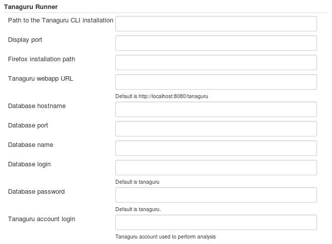

# Configuration

Go to Jenkins > Manage Jenkins > Configure system, go down to the *Tanaguru Runner* section



@@@ make another screenshot with mandatory fields

## Path to the Tanaguru CLI installation (Mandatory)

Path to the local Tanaguru CLI

Example:

```bash
/opt/tanaguru-cli/
```

## Display port (Mandatory)

Value of the display port configured for the [Xvfb startup script](install-doc.md#Xvfb).

Example:

```bash
98
```

## Path to Firefox binary (Mandatory)

Full path to access the binary of the Firefox installed.

Example:

```bash
/opt/firefox-31esr/firefox
```

**Note:** This is NOT the path (`/opt/firefox/`) that but actually the full path with binary name included (`/opt/firefox/firefox`)

## Tanaguru webapp URL (Mandatory)

The URL where the detailed results of an audit could be viewed.

Examples :

```bash
http://my-tanaguru-host.internal.company.com/
```

```bash
http://my-tanaguru-host.preprod.company.com:8080/tanaguru/
```

**Note:** This value should never be `localhost` (except for a single host install on a laptop, that may travel).
For a multiple host, this must be the DNS name of the Tanaguru Host (not the Jenkins host) (This is used only to create a link to access the detailed results of an audit.)

## Database information (Mandatory)

All the information to access the MySql.

In a Multiple host installation, this is the "shared" MySql between the Jenkins host and the Tanaguru host

### Database hostname (Mandatory)

Hostname of the server hosting the MySql database

```bash
my-sql-host.internal.company.com
```

### Database port (Mandatory)

Port to connect to on the MySql host

```bash
3306
```

### Database name (Mandatory)

Name of the database used for Tanaguru

```bash
my-tanaguru-dbname
```

### Database login (Mandatory)

Username to log in Mysql

```bash
my-tanaguru-db-username
```

### Database password (Mandatory)

Password to log in MySql

```bash
my-tanaguru-db-passwd
```

## Tanaguru account login (Mandatory)

The account to whom the contracts will be attached to. This user must **have been created before** on the Tanaguru host.

```bash
my-jenkins-user@internal.company.com
```

**Note:** Each (Jenkins) Item will automatically create a contract for this user,
just after the first build. The contract name will be the item name. The contract
will have the scenario feature activated. The scenario name will be the one given
in the configuration of the item (Build section).