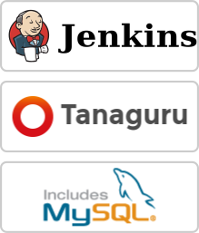
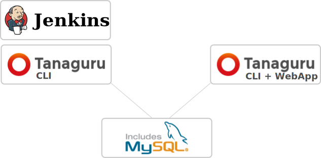

# Network architecture 

You may use Tanaguru Jenkins plugin in two different ways :

* one single host for the whole stack
* stack split over two or more hosts

## One single host

One single host carries the whole stack (Jenkins, Tanaguru, MySQL).

## Two of more hosts

If you have multiple Jenkins and want to use only one uniq Tanaguru to
view the details of an audit, you can :

* have a Tanaguru CLI (Command Line Interface) installed on the Jenkins host,
* have a full Tanaguru on another host,
* and have both Tanaguru share the same MySQL database.

## Next step

Proceed to [Installation](install-doc.md)