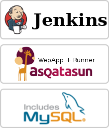
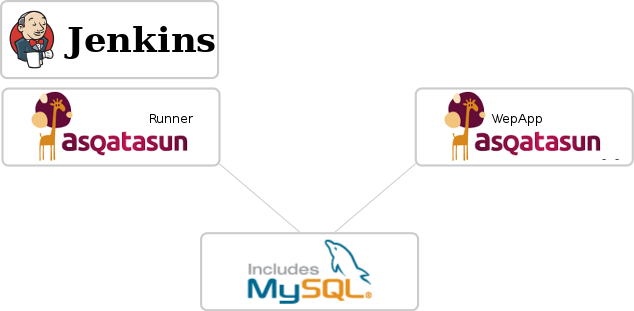

# Network architecture 

## Components

### Required components

* Jenkins
* Asqatasun-Jenkins-Plugin: the plugin from Asqatasun configured in Jenkins (obviously :) )
* Asqatasun-Runner: the engine actually performing the audits
* Mysql / MariaDB database: used by Asqatasun Runner

### Optionnal components (but nice to have)

* Asqatasun: the usual app, this allows to view the details of an audit (otherwise you can see only the global score)

## Architecture

Two points of architecture are important:

* Asqatasun-Runner and Jenkins must be **on the same host**.
* If you add an Asqatasun (to browse details of audits), you must configure it manually to rely on the Mysql/MariaDB **database used by Asqatasun-Runner** (Asqatasun is thus just a viewer of audits).

**Note**: the Mysql/MariaDB database may be on any host, usually it is on the Jenkins host but there is no obligation, your mileage may vary.

### Example: One single host

One single host carries the whole stack:

* Jenkins + Asqatasun-Jenkins-plugin
* Asqatasun-Runner
* Asqatasun
* Mysql / MariaDB database, shared between Asqatasun and Asqatasun-Runner.

### Example: Two hosts

Host with Jenkins: all required components

* Jenkins + Asqatasun-Jenkins-plugin
* Asqatasun-Runner
* Mysql / MariaDB database, shared between Asqatasun and Asqatasun-Runner.

Another host with Asqatasun

* Asqatasun: configured to use the Mysql/MariaDB **on the other host**

In other words, both Asqatasun-Runner and Asqatasun use the same Mysql/MariaDB database

## Next step

Proceed to [Installation](20-install-doc.md)
