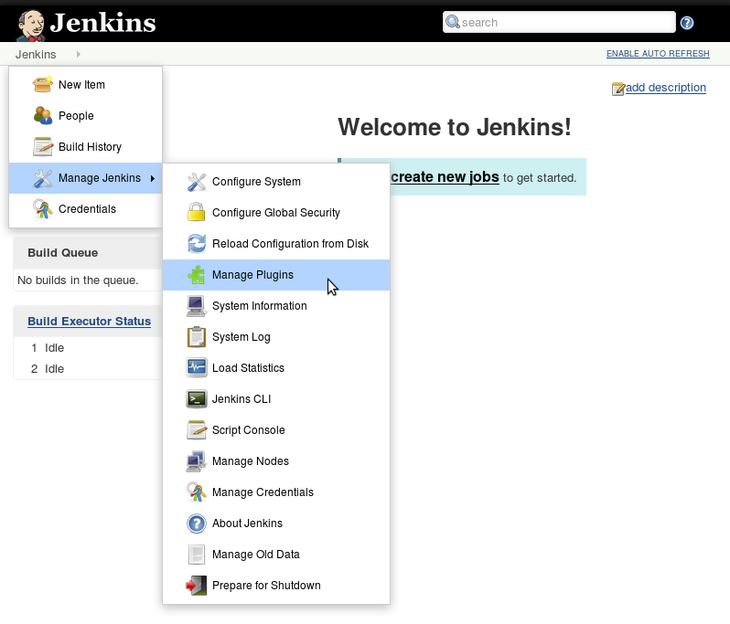
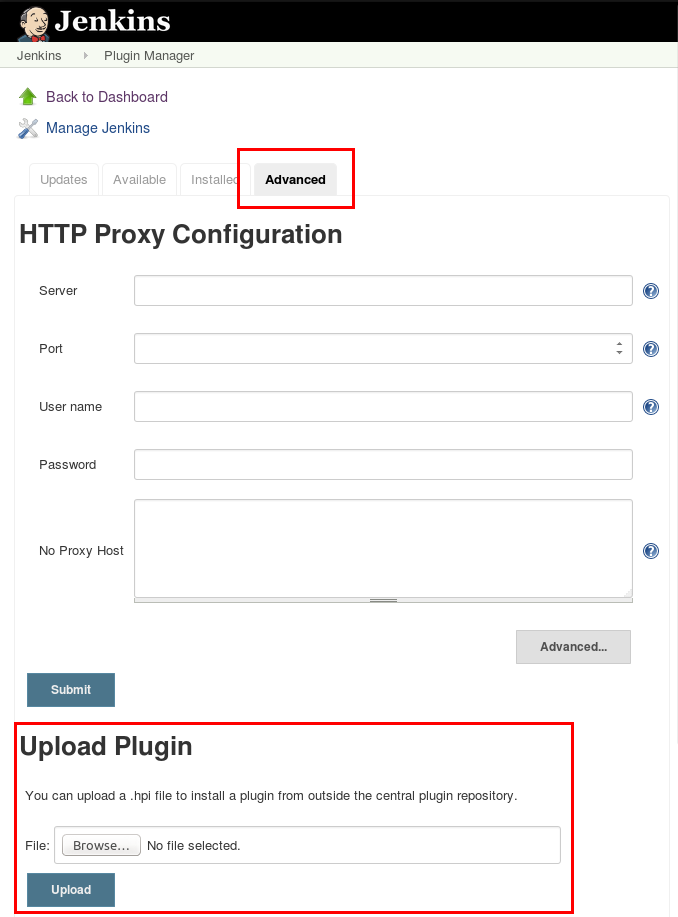

# Installation of Asqatasun-Jenkins-plugin

## Prerequesites

* Java 7
* Jenkins 1.500+ on an Ubuntu Linux box
* Jenkins Plot Plugin  
* XVFB package (see below)
* Asqatasun 4.0.0+ (see below)

### Plot PLugin

Available:

* either from the *Available plugins*
* or from [plot plugin page](https://wiki.jenkins-ci.org/display/JENKINS/Plot+Plugin)


### XVFB

This is the Xvfb used for Jenkins (not the one used for Asqatasun)

```bash
sudo aptitude install xvfb
```

Create the startup script in `/etc/init.d/xvfb`

```bash
sudo touch /etc/init.d/xvfb
```

Add the following content to the xvfb startup script.

```bash
#!/bin/sh

set -e

RUN_AS_USER=jenkins                             # the user is jenkins
OPTS=":98 -screen 1 1024x768x24 -nolisten tcp"  # the port is 98 
XVFB_DIR=/usr/bin
PIDFILE=/var/run/xvfb

case $1 in

start)
    start-stop-daemon --chuid $RUN_AS_USER -b --start --exec $XVFB_DIR/Xvfb --make-pidfile --pidfile $PIDFILE -- $OPTS &
;;

stop)
    start-stop-daemon --stop --user $RUN_AS_USER --pidfile $PIDFILE
    rm -f $PIDFILE
;;

restart)
    if start-stop-daemon --test --stop --user $RUN_AS_USER --pidfile $PIDFILE >/dev/null; then
        $0 stop
    fi;
    $0 start
;;

*)
    echo "Usage: $0 (start|restart|stop)"
    exit 1
;;

esac

exit 0
```

Start Xvfb:

```bash
sudo chmod +x /etc/init.d/xvfb
sudo /etc/init.d/xvfb start
```

Configure Xvfb to run at startup:

```bash
sudo update-rc.d xvfb defaults
```

**Note ** : if you are on a single host installation, you will have two Xvfb : one for Jenkins, another one for Asqatasun.

### Asqatasun

@@@TODO refactor

#### Single host install

@@@TODO refactor
[Install Asqatasun ](http://doc.asqatasun.org/en/10_Install_doc/Asqatasun/index.html).

#### Multiple hosts install

* we assume you already have a full Asqatasun installed with agiven Mysql database
* [Install Asqatasun Command Line](http://doc.asqatasun.org/en/10_Install_doc/Asqatasun-runner/prerequisites-runner.html) on the 
Jenkins host, and configure it to use the same MySql database

Let `ASQATASUN_RUNNER_DIR` be the directory where Asqatasun-Runner is installed (for 
instance `/opt/asqatasun-runner/`, containing the `bin/` `conf/` `lib/` `logs/` directories)

Run:

```bash
sudo chown -R jenkins ASQATASUN_RUNNER_DIR
```

## Installation

Grab the [Asqatasun Jenkins plugin (.hpi, ~720kb)](https://github.com/Asqatasun/Asqatasun-Jenkins-Plugin/releases/latest)

Upload the plugin. Go to **Manage Jenkins** > **Manage plugins**



Go to Advanced tab and upload the **.hpi** file



If you had ever played with **Asqatasun-Runner** before, please run:

```bash
sudo rm -rf  /tmp/org.hibernate.cache.*
```

## Next step

proceed to [Configuration](30-configuration.md)
